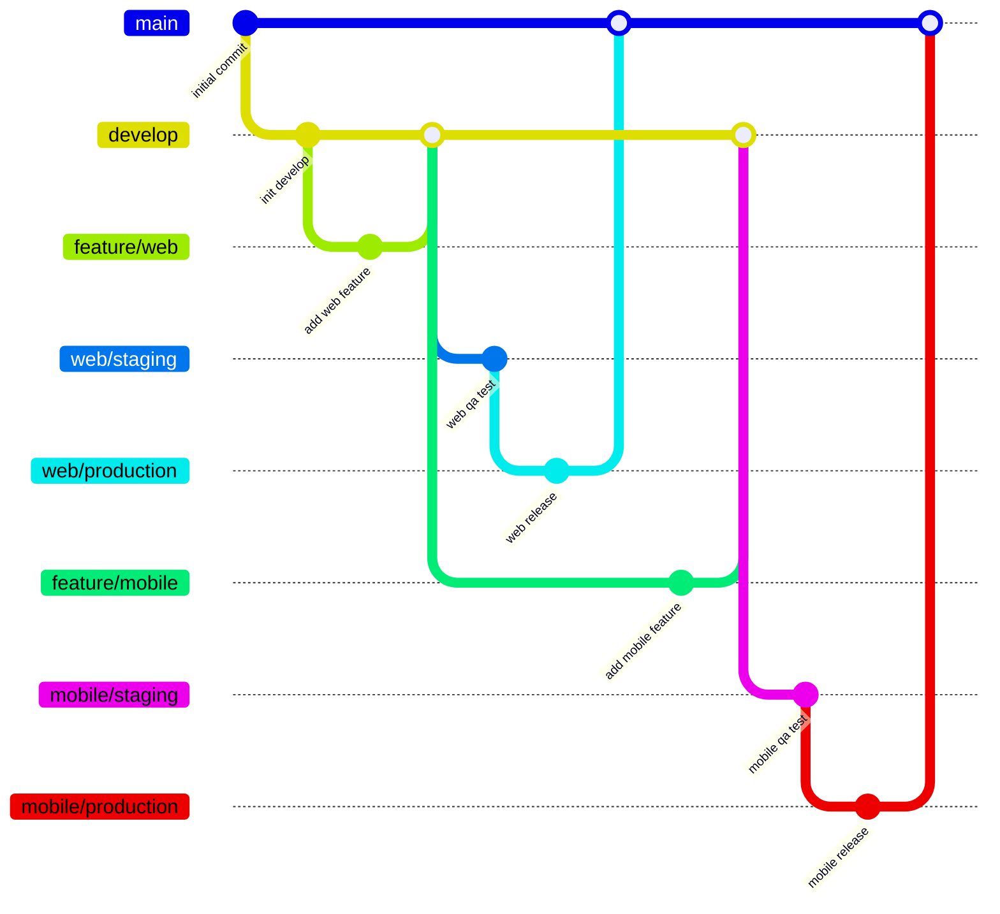

# REME 브랜치 전략

## 1. 전략 개요

### 1.1. 전략 유형

- Modified GitFlow + Scoped Release Monorepo
- 각 앱/패키지별 독립적 개발/배포 지원
- 패키지 간 의존성 관리 강화

### 1.2. 브랜치 구조 다이어그램

---

## 2. 브랜치 구조

### 2.1. 주요 브랜치

| 브랜치    | 설명                          |
| --------- | ----------------------------- |
| `main`    | 프로덕션 릴리즈용 최종 브랜치 |
| `develop` | 통합 개발 브랜치              |
| `staging` | 전체 QA 테스트용 통합 브랜치  |

### 2.2. 앱/패키지별 브랜치

- `apps/web/feature/*`: 웹 앱 기능 개발
- `apps/mobile/feature/*`: 모바일 기능 개발
- `libs/shared/feature/*`: 공통 유틸/설정 패키지 개발
- `docs/feature/*`: 문서 관련 작업

### 2.3. 환경별 브랜치

- `{scope}/staging`: QA 배포용
- `{scope}/production`: 실제 릴리즈 대상

---

## 3. 브랜치 운영 규칙

### 3.1. 기능 개발

1. `develop`에서 `feature` 브랜치 생성
2. 작업 완료 후 `develop`으로 PR
3. squash 머지 후 `develop`에 반영

### 3.2. 앱/패키지 환경 배포

| 대상                             | 브랜치 운영                                                   |
| -------------------------------- | ------------------------------------------------------------- |
| `web`, `api`, `shared`, `mobile` | `develop` → `{scope}/staging` → `{scope}/production` → `main` |
